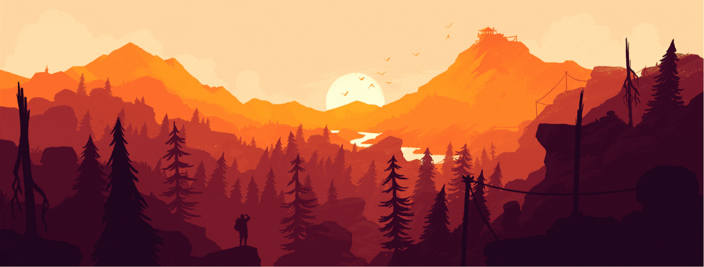

<h2 align="center"> Full Stack Developer </h2>

¡Hola! 👋 Mi nombre es Nicolas Liasso y soy Abogado y Full Stack Developer.
Combino mi experiencia laboral previa con mis conocimientos en desarrollo web para brindar la mejor experiencia posible
tanto al usuario como al product owner.

## ✨Skills✨

<h3>Como contactarme:</h3> 

<a href="https://www.linkedin.com/in/nicolas-liasso/" >
<a href="mailto:nliasso@hotmail.com" >
<a href="https://talent.soyhenry.com/app/nicolas.liasso" >

<!--
**NLiasso/Nliasso** is a ✨ _special_ ✨ repository because its `README.md` (this file) appears on your GitHub profile.

Here are some ideas to get you started:

- 🔭 I’m currently working on ...
- 🌱 I’m currently learning ...
- 👯 I’m looking to collaborate on ...
- 🤔 I’m looking for help with ...
- 💬 Ask me about ...
- 📫 How to reach me: ...
- 😄 Pronouns: ...
- ⚡ Fun fact: ...
-->
